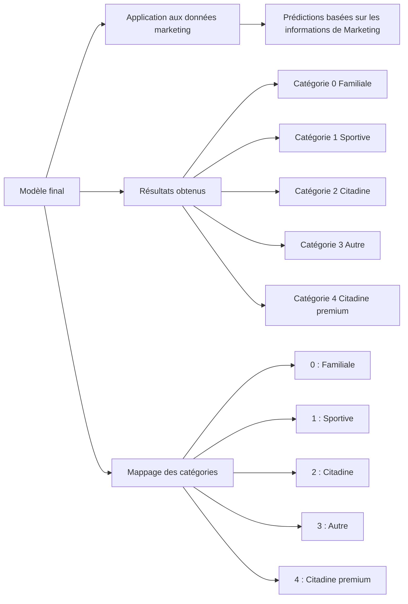

```mermaid


graph LR
    A[Modèle final]

    %% Application du modèle
    A --> B[Application aux données marketing]
    B --> C[Prédictions basées sur les informations de Marketing]

    %% Résultats obtenus
    A --> D[Résultats obtenus]
    D --> E[Catégorie 0 Familiale]
    D --> F[Catégorie 1 Sportive]
    D --> G[Catégorie 2 Citadine]
    D --> I[Catégorie 3 Autre]
    D --> H[Catégorie 4 Citadine premium]

    %% Mappage des catégories
    A --> J[Mappage des catégories]
    J --> K[0 : Familiale]
    J --> L[1 : Sportive]
    J --> M[2 : Citadine]
    J --> N[3 : Autre]
    J --> O[4 : Citadine premium]


```
