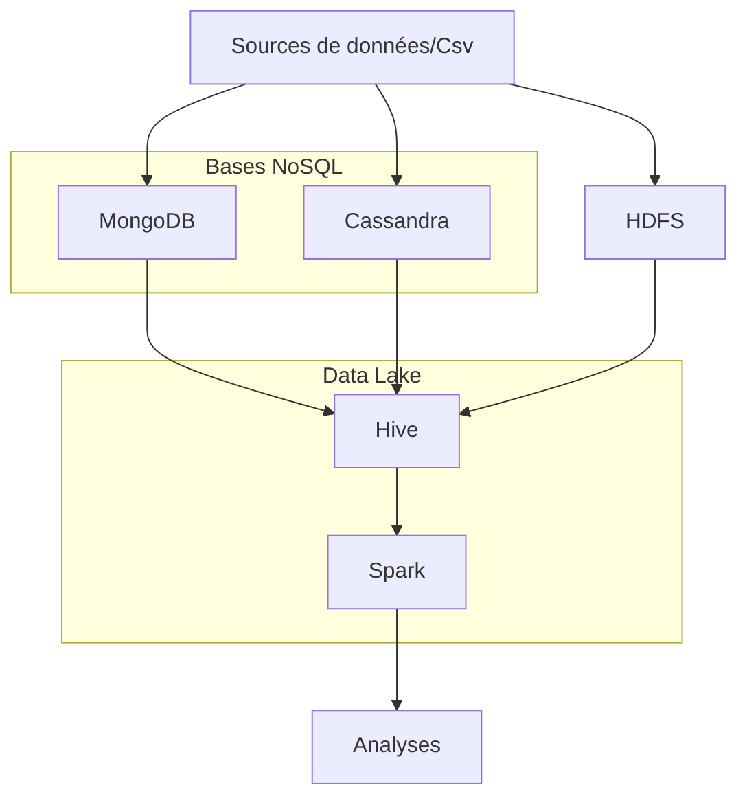

```mermaid
graph TD
A[Sources de données/Csv] --> B[MongoDB]
A --> C[Cassandra]
A --> D[HDFS]

    B --> E[Hive External Table]
    C --> E
    D --> E

    E --> F[Spark]
    F --> G[Analyses]

    subgraph Data Lake
        E[Hive]
        F
    end

    subgraph Bases NoSQL
        B
        C
    end

```
